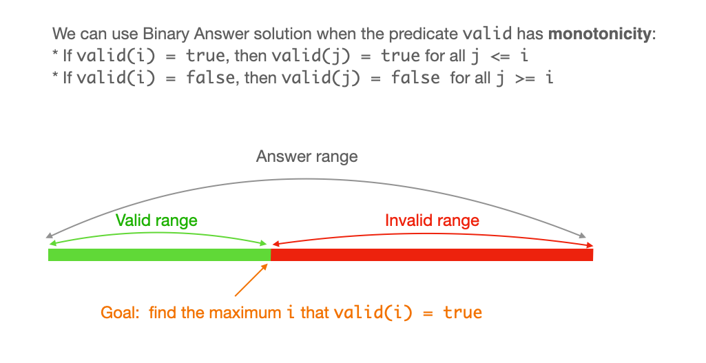

# Binary Tree

A binary tree is a tree in which each node has at most two children, called **left** and **right** child.&#x20;

A **complete binary tree** means that in each level, except the last one, is completely filled.

A **balanced binary tree** is a binary tree in which the left and right subtrees of every node differ in height by no more than one.


## Traversals

<figure><figcaption></figcaption></figure>

* **inorder traversal:** Traverse the left subtree, visit the root, traverse the right subtree. In the example, 2-7-5-6-11-1-9-5-9.&#x20;
* **preorder traversal**, Visit the root, traverse the left subtree, traverse the right subtree. In the example, 1-7-2-6-5-11-9-9-5
* **postorder traversal**, Traverse the left subtree, traverse the right subtree, visit the root. In the example, 2-5-11-6-7-5-9-9-1&#x20;

### Iterative Implementations

In recursive code, the compiler uses the call stack to convert into iterative code. In our implementation, we'll need to mimic this behavior by using an explicit stack.


#### Iterative Preorder Traversal

* first process the root, then go to the left subtree and process the root node of the left subtree. Continue going left until we reach the leftmost node.
* if the leftmost node has a right child, recursion will go to the right subtree, process all nodes and backtrack to the leftmost node.
* if the leftmost node is a leaf node, the recursion will backtrack to its parent

Behavior with a stack:

```python
def iterativePreorder(root):
    if root is None:
        return
        
    treeStack = []
    currNode = root
    
    while treeStack or currNode:
        if currNode:
            treeStack.append(currNode)
            currNode = currNode.left
        else:
            prevNode = treeStack.pop()
            currNode = prevNode.right
```

The procedure can be optimized in terms of space by storing `currNode.right` and not `currNode`.

The time complexity of the algorithm is $$O(n)$$ and the space complexity is $$O(h)$$, where h is the height of the tree.


#### Iterative Inorder Traversal


&#x20;
